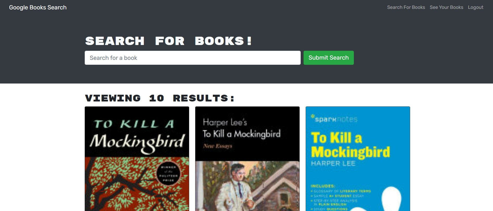

# Google Book Search Engine

## Screenshot:

## USAGE:

- This Book Search Engine allows you to search any book and add it to a personal profile.

## USER STORY:

As a book reader,

- I want a website where I can log in when I have created a webiste
- SO I can return to the website
- I want to be shown a variety of books when I use the search bar to look for a book
- SO I can find any book I want
- I want to be able to save that book
- SO I may return to that book in my profile
- I want to be be shown all my saved books under my profile
- I want to be able to delete books I no longer want saved
- SO I do not re-read

## Technology learnt/used

- React, GraphQL, Apollo

## Site:

https://book-search-engine-20394.herokuapp.com/
